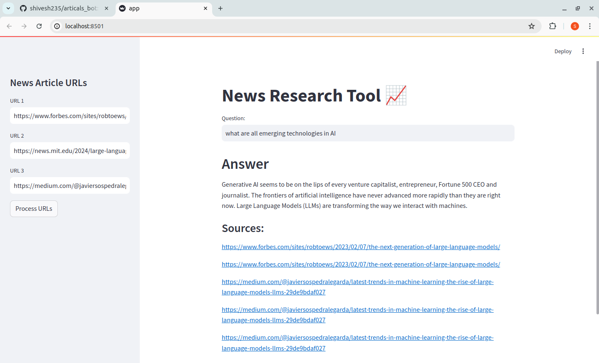

## News Research Tool

This project implements a news research tool using Streamlit for a user-friendly interface and various NLP libraries for processing and summarizing news articles. 



**Features:**

* Allows users to input some news article URLs.
* Processes the articles and generates sentence embeddings for efficient searching.
* Enables users to ask questions about the content of the provided articles.
* Utilizes a pre-trained summarization model to provide summaries of relevant article sections in response to the user's question.
* Displays the sources of the information used in the answer.

**Technical Stack:**

* Streamlit: Web framework for building dashboards and applications.
* langchain: Library for building document processing pipelines.
* faiss: Library for efficient similarity search with high-dimensional vectors.
* transformers: Library for pre-trained NLP models.
* sentence-transformers: Library for generating sentence embeddings.

## Installation

1.Clone this repository to your local machine using:

```bash
git clone https://github.com/shivesh235/articals_bot.git
```
2.Navigate to the project directory:

```bash
cd articals_bot
```
3. Install the required libraries (`pip install streamlit langchain faiss transformers sentence-transformers`).


## Usage/Examples

1. Run the Streamlit app by executing:
```bash
streamlit run app.py

```

2.The web app will open in your browser.

- On the sidebar, you can input URLs directly.

- Initiate the data loading and processing by clicking "Process URLs."

- Observe the system as it performs text splitting, generates embedding vectors, and efficiently indexes them using FAISS.

- The embeddings will be stored and indexed using FAISS, enhancing retrieval speed.

- The FAISS index will be saved in a local file path in pickle format for future use.
- One can now ask a question and get the answer based on those news articles
